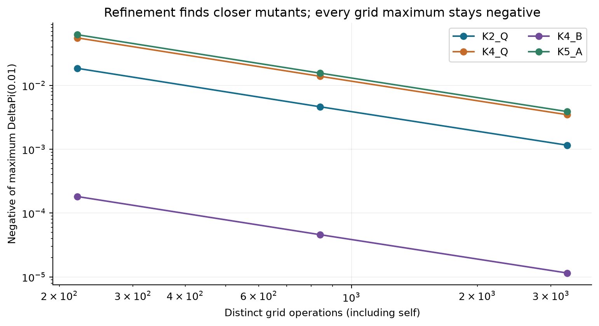
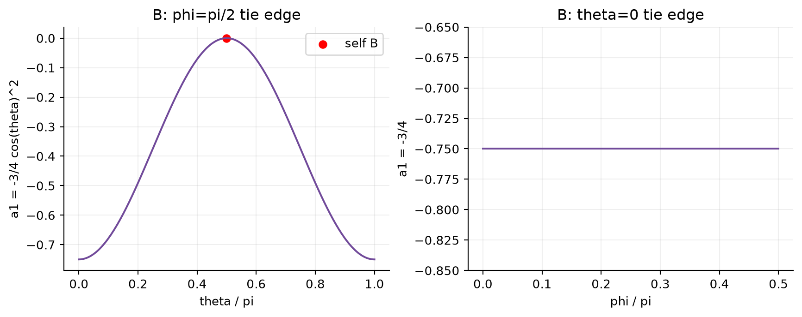
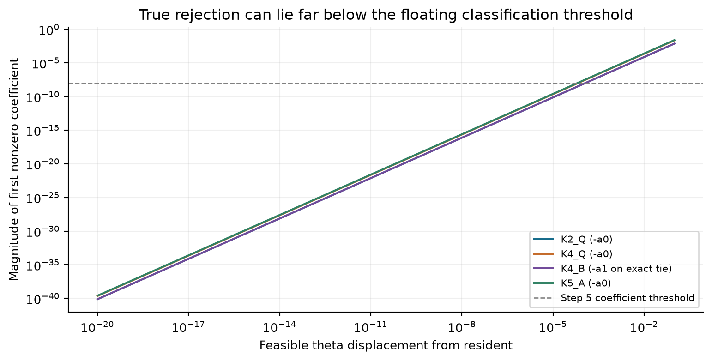
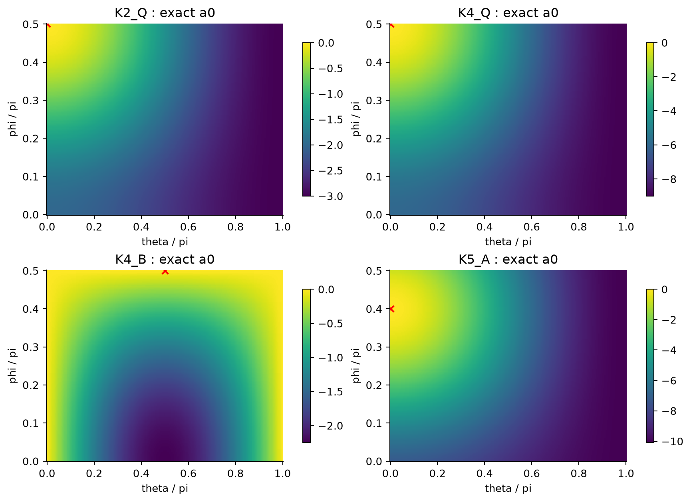

# Step 6: Restricted EWL ESS Resolution

Q-ESS research handoff | 2 October 2026 (America/Phoenix) | Version 1

## Result and scope

**All four Step 5 survivors are proven ESS within the specified restricted two-parameter EWL family.** The proof uses exact coefficient identities and complete zero-set analysis. Dense grids and optimizers independently support the result but do not establish it. No distinct exact neutral mutant survives. K=4 B has a unilateral tie manifold, resolved by a negative first-order coefficient.

The conclusion uses the requested definition: for each fixed distinct pure mutant, mutant fitness is lower at sufficiently small positive frequency. The frequency bound may depend on the mutant. No full-SU(2), entanglement, noise, dynamics, mixed-mutant, or asymmetric-population claim is made.

## Frozen Step 5 baseline

Steps 1-4: 5827d9aaf631f67a02713eb8643609a7730707d2. Step 5 validated head: b174ec298187655e8d2eb143fe5509d7fcbc60d8. Step 5 PR #5 was squash merged as 655c86574b6c989f25153c7ad500b5b15d6e8316; the merged tree exactly matches the validated tree.

All 58 existing tests passed, with zero failures or skips. Both original and Mac Mini saved validators passed: 5,487 and 5,491 detailed rows respectively; 16/16 global optimizer successes in each; two rejected / four unresolved classifications unchanged. Reconstructed coefficients and frequency diagnostics matched exactly. Fresh six-pair comparisons in each dataset differed by at most 3.56e-14. K=3 B and K=5 B remain rejected at orders 1 and 3 respectively.

The primary checkout was switched to main by another process during work. Step 6 development continued in the isolated local worktree tmp/step6-worktree under the Mac project; no experiments or Git operations ran on WorkHub.

## Question, model, and method

For K=2 Q=(0,pi/2), K=4 Q=(0,pi/2), K=4 B=(pi/2,pi/2), and K=5 A=(0,2pi/5), decide the sign of the first genuinely nonzero coefficient of DeltaPi(epsilon)=sum_m a_m epsilon^m for every physically distinct mutant.

Domain: 0<=theta<=pi and 0<=phi<=pi/2. Entanglement: gamma=pi/2. Strategy matrix: [[exp(i phi) cos(theta/2),sin(theta/2)],[-sin(theta/2),exp(-i phi) cos(theta/2)]]. The parity-adjusted generator is G=D^tensorK for even K and iD^tensorK for odd K; J=(I+iG)/sqrt(2). Payoffs sum pairwise PD (3,0,5,1). Population sampling is infinite and well mixed.

For n=K-1, b_j=u_M(j)-u_R(j) and a_m=C(n,m) sum_{j<=m} (-1)^(m-j) C(m,j)b_j. The K=2 implementation gives a0=u(M,R)-u(R,R), a1=u(M,M)-u(R,M)-a0; on an exact a0 tie it is precisely the Maynard-Smith second condition.

Use x=cos(theta/2)cos(phi), y=cos(theta/2)sin(phi), s=sin(theta/2), all nonnegative with x^2+y^2+s^2=1. Exact endpoint state amplitudes yield polynomial composition payoffs. SymPy verifies the certificate identities with zero polynomial remainders. A separate 80-digit dense tensor implementation checks selected points and derivatives.

## Complete global sign certificate

| Resident | Exact a0 | Zero-set resolution |
|---|---|---|
| K2_Q | -3 sin(theta/2)^2 - 2 cos(theta/2)^2 cos(phi)^2 | Only self ties; a0<0 for every distinct mutant. |
| K4_Q | -9 sin(theta/2)^2 - 6 cos(theta/2)^2 cos(phi)^2 | Only self ties; a0<0 for every distinct mutant. |
| K4_B | -(9/4) sin(theta) cos(phi) | On theta=0: a1=-3/4. On phi=pi/2: a1=-(3/4)cos(theta)^2; equality only at B. |
| K5_A | -alpha sin(theta/2)^2 - 8 cos(theta/2)^2 sin(phi-2pi/5)^2 | alpha=(9+5sqrt(5))/2>0. Only self ties. |

For Q and A, each non-self mutant has a0<0. For B, a0=-(9/2)s*x<=0. Its complete zero set is s=0 union x=0, corresponding to theta=0 and phi=pi/2, including canonical D. On these sets a1 is strictly negative except at B. Thus every admissible distinct mutant has a negative leading coefficient, and continuity of its finite polynomial gives a sufficiently small positive invasion-frequency interval. Full derivation and sign arguments are in docs/step6_methods.md; full exact polynomials are saved in symbolic_coefficients.json.

## Local derivatives and feasible boundaries

| Resident | Feasible cone | Gradient a0 | Hessian a0 |
|---|---|---|---|
| K2 Q | dtheta>=0, dphi<=0 | (0,0) | diag(-1.5,-4) |
| K4 Q | dtheta>=0, dphi<=0 | (0,0) | diag(-4.5,-12) |
| K4 B | dtheta free, dphi<=0 | (0,2.25) | zero matrix |
| K5 A | dtheta>=0, dphi free | (0,0) | diag(-5.045084972,-16) |

Q and A have negative definite a0 Hessians on every nonzero feasible direction. B instead has a negative inward directional derivative because dphi<=0. Along the tangent dphi=0, a0 vanishes exactly and a1=-(3/4)sin(dtheta)^2=-(3/4)dtheta^2+(1/4)dtheta^4+O(dtheta^6). The zero a0 Hessian is therefore not evidence of neutrality. All coefficient gradients/Hessians and independent checks are saved, including eigendirections and quartic expansions.

The local ball has angle radius 0.1. Outside it, the exact identities still cover the entire domain. For Q and A, a0 is bounded above by -min(alpha*sin(0.1/(2sqrt(2)))^2, beta*cos(0.1/(2sqrt(2)))^2*sin(0.1/sqrt(2))^2)<0. For B, a0<0 off its tie edges; on the remaining tie edges a1<=-(3/4)sin(0.1)^2 or a1=-3/4. No interval optimizer is needed to fill a gap in this coverage.

## Grid convergence

Canonicalization gives 221, 841, and 3281 operations, or 220, 840, and 3280 mutants after self exclusion for each resident. Every focal position and co-player placement was evaluated. There were no apparent neutral candidates and no positive leading coefficients in these three finite grids. The closest strongest grid candidates approach self as the grid is refined; this explains why maximum fitness differences approach zero.

| Resident | 21x11 max DeltaPi(.01) | 41x21 | 81x41 |
|---|---|---|---|
| K2_Q | -0.018467868 | -0.00462402316 | -0.00115644712 |
| K4_Q | -0.0553876895 | -0.0138710717 | -0.00346927896 |
| K4_B | -0.000181528246 | -4.59151578e-05 | -1.15282295e-05 |
| K5_A | -0.0620929021 | -0.0155510301 | -0.00388949741 |



## Per-resident inspection

The entries below are the strongest non-self mutants on the finest grid under DeltaPi(0.01). There is no attained strongest non-self mutant in the continuous near-self limit. The optimizer near-self candidates are reported separately with high-precision corrections. Full polynomial arrays below are ordinary-precision values; tiny trailing entries are residuals, not exact identities.

### K2_Q

| Quantity | Value |
|---|---|
| K; resident (theta,phi); payoff | 2; (0, 1.57079632679); 3 |
| Step 5 status | neutral_or_weak_candidate |
| Step 6 status | proven_ESS_restricted_EWL |
| Strongest finest-grid mutant | (0.0392699081699, 1.57079632679) |
| Distance from resident | 0.0392699081699 radians |
| Leading order; coefficient | 0; -0.00115644563892 |
| All power coefficients | [-0.00115644563892, -1.48596278837e-07] |
| DeltaPi(0.01) | -0.00115644712488 |
| Local result | Negative definite a0 Hessian; no null direction and no non-self unilateral tie. |
| Global result | Exact sign/zero-set proof; dense and seeded complement searches agree. |
| Neutral set | No distinct exact neutral mutant. |
| Best double optimizer candidate at 80 digits | leading order 0, coefficient -1.5807239e-17 (negative) |

### K4_Q

| Quantity | Value |
|---|---|
| K; resident (theta,phi); payoff | 4; (0, 1.57079632679); 9 |
| Step 5 status | neutral_or_weak_candidate |
| Step 6 status | proven_ESS_restricted_EWL |
| Strongest finest-grid mutant | (0.0392699081699, 1.57079632679) |
| Distance from resident | 0.0392699081699 radians |
| Leading order; coefficient | 0; -0.00346933691675 |
| All power coefficients | [-0.00346933691675, 5.79525489997e-06, -2.4057982273e-09, -1.06581410364e-14] |
| DeltaPi(0.01) | -0.00346927896444 |
| Local result | Negative definite a0 Hessian; no null direction and no non-self unilateral tie. |
| Global result | Exact sign/zero-set proof; dense and seeded complement searches agree. |
| Neutral set | No distinct exact neutral mutant. |
| Best double optimizer candidate at 80 digits | leading order 0, coefficient -4.7421718e-17 (negative) |

### K4_B

| Quantity | Value |
|---|---|
| K; resident (theta,phi); payoff | 4; (1.57079632679, 1.57079632679); 6.75 |
| Step 5 status | neutral_or_weak_candidate |
| Step 6 status | proven_ESS_restricted_EWL |
| Strongest finest-grid mutant | (1.53152641863, 1.57079632679) |
| Distance from resident | 0.0392699081699 radians |
| Leading order; coefficient | 1; -0.00115599985007 |
| All power coefficients | [-8.881784197e-16, -0.00115599985007, 0.000317690387906, 8.881784197e-15] |
| DeltaPi(0.01) | -1.15282294628e-05 |
| Local result | Linear rejection into the interior; negative quadratic a1 along the boundary tangent. The two complete unilateral tie edges contain no distinct neutral mutant. |
| Global result | Exact sign/zero-set proof; dense and seeded complement searches agree. |
| Neutral set | No distinct exact neutral mutant. |
| Best double optimizer candidate at 80 digits | leading order 1, coefficient -1.597393e-17 (negative) |

### K5_A

| Quantity | Value |
|---|---|
| K; resident (theta,phi); payoff | 5; (0, 1.25663706144); 12 |
| Step 5 status | neutral_or_weak_candidate |
| Step 6 status | proven_ESS_restricted_EWL |
| Strongest finest-grid mutant | (0.0392699081699, 1.25663706144) |
| Distance from resident | 0.0392699081699 radians |
| Leading order; coefficient | 0; -0.00388957767579 |
| All power coefficients | [-0.00388957767579, 8.02615394946e-06, -5.17664844324e-09, 1.36424205266e-12, 8.881784197e-15] |
| DeltaPi(0.01) | -0.00388949741477 |
| Local result | Negative definite a0 Hessian despite the theta boundary; unique phase zero at 2pi/5. |
| Global result | Exact sign/zero-set proof; dense and seeded complement searches agree. |
| Neutral set | No distinct exact neutral mutant. |
| Best double optimizer candidate at 80 digits | leading order 0, coefficient -1.0379692e-16 (negative) |

## Coefficient searches and precision

The saved search contains 84 runs: 52/52 differential-evolution global runs converged and 31/32 L-BFGS-B runs converged. The failed local run is K5_A from start [1.7320972906990553,0.9266223065815113], with message 'ABNORMAL: ' and objective a0=-1.038e-16; it is retained as failed. This numerical limit does not enter the analytic proof.

Stage 0 maximizes a0 on the rectangle and on distance>=0.1, with three fixed seeds. All four boundaries are searched explicitly. Stage 1 for B uses exact edge parametrizations and complement subintervals. No loose threshold defines a tie constraint. Configurations, seeds, starts, iteration counts, evaluation counts, messages, final coordinates, and polynomials are retained.

There are 26 independent 80-digit checks, including displacements of 1e-20 and both B tie edges. Maximum ordinary/high-precision coefficient difference is 7.09e-14. Real centered 80-digit finite differences with step 1e-12 check every saved gradient/Hessian; maximum error after comparison in ordinary precision is 1.15e-21. The 1e-60 high-precision threshold is diagnostic only. Exact neutrality is decided algebraically.

| Audit | Maximum residual |
|---|---|
| focal_position_spread | 2.49e-14 |
| placement_spread | 1.24e-14 |
| probability_error | 1.67e-15 |
| reconstruction_error | 7.11e-15 |
| Saved coefficient/fitness reconstruction | 1.42e-14 |





## Literature, novelty, and Step 7

The project references A. Iqbal and A.H. Toor, Evolutionarily Stable Strategies in Quantum Games, Physics Letters A 280 (5-6), 249-256 (2001), arXiv:quant-ph/0007100v3, DOI 10.1016/S0375-9601(01)00082-2. Their two-player discussion concerns restricted strategy access and the ESS conditions. The K=2 result here is independently recovered, not a novel claim. See https://arxiv.org/abs/quant-ph/0007100v3.

The related project reference is S.C. Benjamin and P.M. Hayden, Comment on Quantum Games and Quantum Strategies, Physical Review Letters 87, 069801 (2001), https://arxiv.org/abs/quant-ph/0003036. Admissible quantum strategy families can change stability conclusions. Restricted-family ESS does not establish full-SU(2) ESS; another game-specific result cannot be imported without matching the payoff, entangler, strategy set, and evolutionary definition.

Recommended next action: research review of the exact K=4 B tie-set calculation and K=5 radical identity. After review, explicitly authorize Step 7: add the third unitary parameter, first perform the full-SU(2) unilateral Nash screen, and apply population ESS analysis only to its survivors.

Future only: Step 8 re-identifies symmetric Nash candidates at each entanglement value; Step 9 adds explicit physical noise; Step 10 studies replicator dynamics. Polymorphic/asymmetric resident populations remain a later project. None was executed here.

## Reproduction and limits

The numerical experiment commit is 447373ff87c6bbec8bdb28dc6c43f8e0d37b9286. Runtime: 9.348 seconds for the recorded full experiment, including symbolic and precision work. This excludes implementation, baseline validation, report rendering, and tests. Hardware: Apple M5 Max, 18 logical CPUs; workers: 1. Python: 3.12.14 (main, Aug 12 2026, 13:57:54) [Clang 21.0.0 (clang-2100.3.34.2)]. Seeds: 20261002, 20261003, 20261004. The complete run settings and exact dependencies are in run_metadata.json and requirements-step6.txt.

Commands, executed from the local Step 6 worktree:

```sh
PYTHONPATH=src studio-python -m unittest discover -s tests
studio-python scripts/validate_step5_results.py
studio-python scripts/validate_step5_results.py --results-dir results/step5_macmini_20260828
PYTHONPATH=src studio-python scripts/audit_step5_for_step6.py
PYTHONPATH=src studio-python scripts/run_step6.py --output-dir results/step6
PYTHONPATH=src studio-python scripts/validate_step6_results.py
PYTHONPATH=src studio-python scripts/build_step6_report.py
PYTHONPATH=src studio-python scripts/build_step6_notebook.py
```

The full suite passes 75 tests, with zero failures and zero skips. The independent saved-data validator passes all 17,360 rows and six exact identity checks. The full test outcome is saved separately in results/step6/test_results.txt. Requirements use an isolated environment; the Mac Mini repeat is preserved as separate baseline evidence in the portable delivery.

What is proved: pointwise rare-mutant stability of these four residents over the entire specified pure restricted-EWL domain. What is numerical: grid convergence values, optimizer outcomes, residual/error measurements, and finite-difference cross-checks. Remaining limitation: this is a reviewable analytic/symbolic certificate, not machine verification in a proof assistant. No unresolved domain or null-direction gap remains within the stated problem. No assertion about a uniform invasion barrier or enlarged strategy access is made.

## Artifact index

| Path relative to project/worktree | Contents |
|---|---|
| results/step6/mutant_coefficients.csv.gz | All 17,360 mutants; full compositions, coefficients, aliases, focal arrays, diagnostics and errors |
| results/step6/grid_convergence.csv; resident_summary.csv | Three-resolution convergence and four resident summaries |
| results/step6/coefficient_optimizer_runs.csv | All 84 optimizer attempts, including the failed local refinement |
| results/step6/precision_validation.csv | 26 independent 80-digit probes; tiny values retained as strings |
| results/step6/local_derivative_analysis.json | All coefficient derivatives, feasible cones, Taylor expansions, independent checks |
| results/step6/symbolic_coefficients.json; certification_summary.json; neutral_sets.json | Exact formulas, zero-set identities and certificate |
| results/step6/run_metadata.json; data_manifest.json; baseline_audit.json | Runtime provenance, hashes and frozen baseline validation |
| results/step6/plots/ | Four plots, each PNG and vector PDF |
| docs/step6_methods.md | Detailed mathematical argument, methods and reproduction |
| notebooks/step6_restricted_ewl_ess_resolution.ipynb | Executed inspection notebook |
| output/step6/Step6_Restricted_EWL_ESS_Resolution.md and .pdf | This research report |


